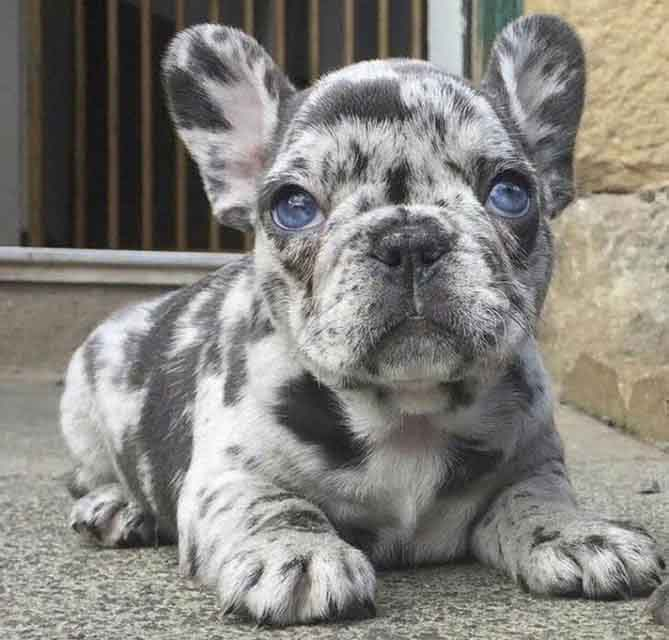
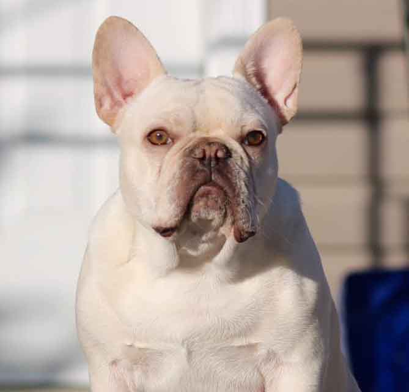
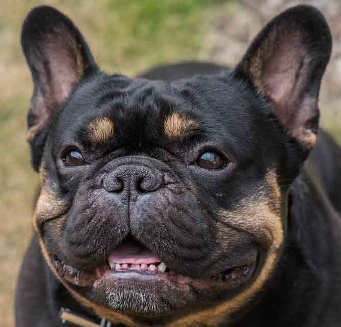
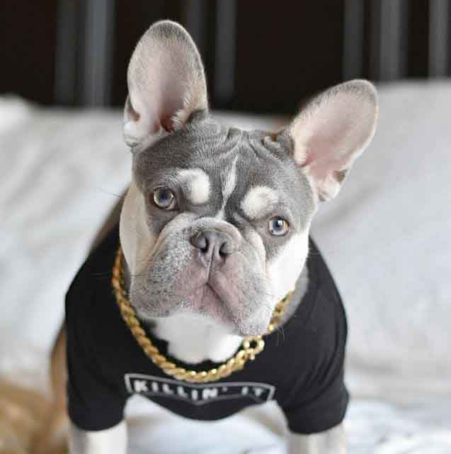
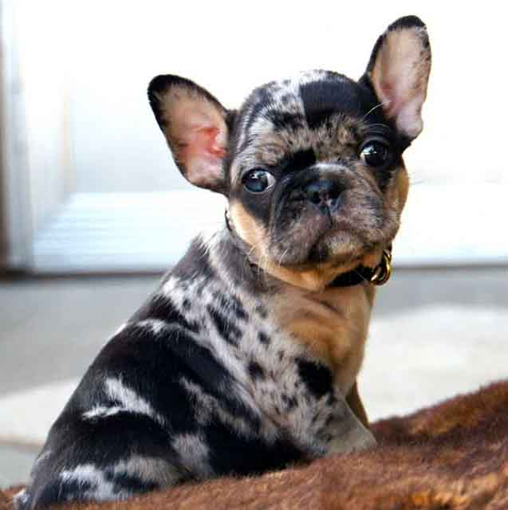
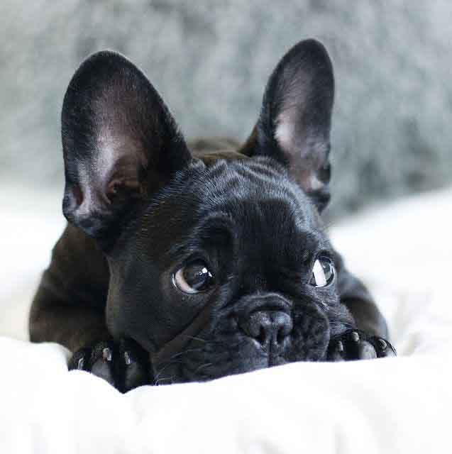

## French Bulldog Colors. The Standard and The Rare.

 I get so many questions about French Bulldog colors on a daily basis. I’ve scrolled online trying to find an article that covers all the French Bulldog Colors and show it to my customers as an example, but nothing extensive popped up, so I decided it’s time to write my own.

I will try to keep it as simple as possible as well as cover some basic questions regarding pricing. Keep in mind that the prices vary based on color, bloodlines and breeding rights. It will cost you more to get a specific dog with a full AKC registration, than getting it just as a family pet.

## Standard French Bulldog Colors and Patterns

Which are standard French Bulldog colors and patterns? Let's start at the beginning..

In 1897, the only original breed standard was considered brindle. After the 1911 standard revision they approved additional standard colors and patterns like fawn, cream, piebald,.. To this day any deviation from the standard equals disqualification. The standard **French Bulldog colors** are the only ones allowed to compete in the ring.

> _Acceptable colors – All brindle, fawn, white, brindle and white, and any color except_\
> _those which constitute disqualification. All colors are acceptable with the exception of solid black, mouse, liver, black and tan, black and white, and white with black, which are disqualifications. Black means black without a trace of brindle._
>
> **AKC, American Kennel club**

If you are trying to invest into a standard colored French Bulldog, from a responsible breeder – as a pet only, you will usually be looking at prices between 2,500-3,000$. 

However a standard color price can still go up to 5,000 – 6,000$ if bought from a breeder with champion bloodlines and amazing quality French Bulldogs.
{ include igcta3.html}

### Brindle French Bulldog Pattern


Brindle  is one of the most common French Bulldog patterns.

**Brindle French Bulldog** has a base coat of fawn hairs through which black hairs extend in bands to produce a coat that can range from a tiger brindle in which fawn hairs predominate to the more common dark brindles in which the black hairs predominate. The light version with fawn hairs that predominate is also known as a "reverse brindle", and it's generally more rare.

### Piebald Pattern


The **piebald** is not a French Bulldog color, it’s a pattern. **Pied** animal is one that has a **pattern** of pigmented spots on an unpigmented (white) background of hair.

The **pied French Bulldog** comes in multiple standard color variations. Brindle pied, fawn pied, red fawn pied, etc.. Of course pied can also come in an exotic color variation, but we will discuss that more in depth further down the line. 

### Cream French Bulldog



What is a **cream French Bulldog**? Many light **fawn French Bulldogs** are mistaken for a cream.

 A true cream Frenchie will look slightly off white throughout – solid color. Its a recessive dilute from the fawn coat. 

They have no markings on them, they have black pigment, black noses, black eye rims, black paw pads, and black lips. The DNA of a true cream French Bulldog is different than the one of the light fawn.
{ include igcta4.html}

[**Click here to read more about the differences between these French Bulldog Colors**](http://frenchbulldogsaustralia.com.au/french-bulldog-puppy-buyers-guide/true-cream-vs-fawn-vs-pied/ "Cream French Bulldog color").

### Fawn French Bulldog Colors


The **fawn French Bulldog** colors come in different shades, from very light, almost cream looking ones, to a deep red fawn. They can have a mask, like the one pictured above, or be maskless. 

Fawn can also be combined with an exotic color in which the dilution affects the "black mask", eyes, nose and paw pads (Blue fawn, lilac fawn, chocolate fawn,..)

## Exotic French Bulldog Colors and Patterns

**Exotic Colors and Patterns in the French Bulldog breed** are the one that aren’t approved by the AKC and can’t participate in the ring. 

They can still be AKC registered and are 100% French Bulldogs, but unfortunately can’t compete due to their coat color being an instant disqualification.

### Blue French Bulldog


The beautiful **blue (gray) French Bulldog color** is a results of a dilution gene. The dilution gene affects **eumelanin** (liver and black coats), in some instances, the red coat as well.

When a dog has two copies of the d allele (dd), a black dog will become blue. The coat range is wide – from very light gray to almost black, but even in that case it can be visible that the dog is dd, by looking at the color shade of his nose.

The **blue French Bulldog** color is in the rare or exotic color price range. It will cost you between 4000-6000 $ to get a blue canine companion.



All of the coat colors can come in a variation with a pattern (piebald, brindle, merle) + a different color. The puppy picture above is a Blue Pied.

[**Click here to check out our Blue French Bulldog Puppies available**](https://ethicalfrenchie.com/puppies/ "Blue French Bulldog Puppies")

### Lilac French Bulldog Colors


These rare lilacs are a result of their parents blue and chocolate DNA. The same dilution gene that causes a black dog to become blue (like mentioned above), causes a chocolate/liver dog to become a lilac.

[**Click here to learn more about this type of dilution**](http://www.doggenetics.co.uk/dilutes.html#isabella "Isabella dilution")

A lilac French Bulldog dog will have the genotype **bbdd** (homozygous for liver, homozygous for dilution). Lilac dogs are usually very light blue, almost silver looking, with light eyes and pinkish tint on their muzzle.

Due to their unique appearance they run in the higher price range of 5000-7000$.
{ include igcta.html}

### Chocolate/ Liver


In the chocolate color case, the dilution of the black color happen on the B locus. It is recessive, so **b** is liver and **B** is non-liver, and in order for a dog to be liver it must have the genotype **bb**.

### Merle Pattern

The merle gene creates mottled patches of color in a solid or [piebald](https://en.wikipedia.org/wiki/Piebald "Piebald") coat, and it can affect skin [pigment](https://en.wikipedia.org/wiki/Pigment "Pigment") as well. This pattern is very controversial in the French Bulldog community since it can cause severe health issues, if two merles are bred together.

A merle should only be bred to a dog with a solid coat color. The merle gene itself, does not cause any health issues.

Merle dogs will usually have bright blue eyes, or odd looking eyes (heterochromia iridum). **Heterochromia Iridum** is a difference in coloration of the iris. Merle French Bulldog colors are rare and of course in the higher price range.

### Platinum French Bulldog

An exotic color covered in cream, is what it’s called a **Platinum**. Their coat color is cream, but you can see signs of dilution by looking at their nose, eyes, lips and paw pads. 

While a regular cream French Bulldog would have a black nose, dark eyes and black paw pads, the Platinum French Bulldog will have a diluted version of that.

### Coat Color Combined with Tan Points

Another very beautiful and unique coloration. The price range is wide. You can expect to pay 3000$ for a Black and Tan French Bulldog, to up to 6000-7000$ for a Lilac and Tan or Merle and Tan one.

#### Black and Tan French Bulldog

#### Blue and Tan French Bulldog

#### Lilac and Tan French Bulldog

#### Merle and Tan French Bulldog

### Black and Black Pied French Bulldog Colors

A non-standard color in the standard color price range. These beauties deviate from the acceptable coat colors, but are definitely still in the lower price range.

 A French Bulldog is considered black if the coat color is solid without any signs of brindle, which is rare. Even if a puppy appears black, that might not be the case. A truly **black French Bulldog** has an unique DNA of a/a. 

It will cost you around 2500$ to bring a black or a black pied French Bulldog home. 

